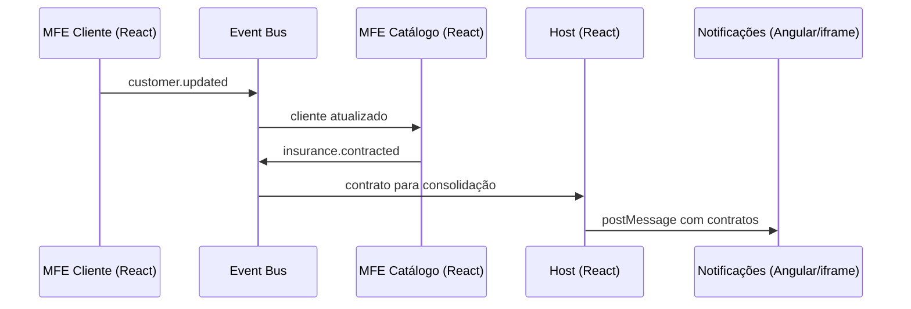

# Guia orientador — demonstração ao vivo

> **Objetivo:** transformar a explicação de arquitetura em uma demonstração prática, curta e previsível. Este documento complementa o roteiro de 1 hora: use-o durante a apresentação para saber **o que clicar, o que abrir no código e qual conceito explicar**.

## Resultado que a demonstração deve provar

Ao final, a audiência deve enxergar este fluxo completo:



Em uma frase: **cada parte tem uma responsabilidade de negócio clara, o Host orquestra a experiência e a integração acontece sem um MFE importar diretamente o outro.**

---

## Conceitos curtos para explicar antes da demonstração

### O que são Host, remote e Module Federation?

- **Host** é a aplicação que compõe a experiência: neste projeto, ela oferece navegação, loading, fallback e o Dashboard consolidado.
- **Remote** é uma aplicação que expõe uma parte da interface para o Host consumir em runtime: aqui, Cliente e Catálogo são remotes React.
- **Module Federation** é o mecanismo que permite ao Host localizar e importar módulos expostos pelos remotes em outro servidor, quando necessário.

**Fala sugerida**

> “O Host monta a experiência final. Cada remote entrega um domínio específico. Module Federation é a ponte que permite ao Host buscar esse módulo remoto em runtime, sem colocá-lo inteiro no bundle inicial.”

### O que é um módulo?

Um **módulo** é uma unidade de código com uma responsabilidade definida que pode exportar algo para ser usado em outro lugar. Esse “algo” pode ser uma função, um componente, um tipo ou uma constante.

Exemplo deste projeto: cada MFE expõe o seu componente principal como um módulo chamado `./App`. O Host então o consome com `import('profile_mfe/App')` ou `import('dashboard_mfe/App')`.

**Fala sugerida**

> “Pense em módulo como uma peça de código com uma porta de entrada bem definida. Em vez de o Host copiar o código do Cliente, ele pede o módulo `App` que o MFE Cliente decidiu expor.”

No contexto de Module Federation, o módulo pode estar em **outra aplicação e outro servidor**. Portanto, o import continua parecendo um import de JavaScript, mas a implementação é descoberta e carregada em runtime.

### O que é `remoteEntry.js`?

`remoteEntry.js` é o **arquivo de entrada do remote**. Ele funciona como um catálogo/runtime: informa ao Host quais módulos aquele MFE disponibiliza e como obter os arquivos JavaScript necessários para executá-los.

Ele não é a tela inteira do MFE nem contém, necessariamente, todo o código do formulário. É o primeiro arquivo que permite ao Host localizar o módulo exposto, como `./App`; depois, o navegador pode buscar chunks adicionais da aplicação.

### O que é fallback?

**Fallback** é uma interface alternativa apresentada quando o conteúdo principal ainda não pode ser mostrado ou falha. Em microfrontends, ele impede que um problema em um remote deixe a tela inteira em branco.

Neste projeto há dois tipos de fallback:

- durante o carregamento: o `Suspense` exibe o componente `Loading`;
- se o remote falhar: `remoteLoaders` mostra a mensagem de indisponibilidade e o `ErrorBoundary` protege a área renderizada.

**Fala sugerida**

> “Fallback é o plano B da interface. Se o remote estiver lento, mostramos loading; se estiver indisponível, mostramos uma mensagem clara. O Host continua funcionando e a falha fica limitada ao domínio afetado.”

### O que é um iframe?

Um **iframe** é uma área dentro de uma página HTML que carrega outra página, com seu próprio documento, JavaScript e runtime. É como abrir uma pequena janela de navegador dentro da tela do Host.

Neste projeto, o Host React abre a aplicação Angular da porta `5003` dentro de um iframe. Como as aplicações ficam isoladas, elas não importam componentes uma da outra. A troca de dados é feita explicitamente com `window.postMessage()`.

**Fala sugerida**

> “O iframe dá isolamento: o Angular pode rodar com seu próprio framework sem misturar o runtime com React. O custo é uma integração mais explícita: para conversar, as duas janelas enviam mensagens com um contrato combinado.”

---

### Por que existe a pasta `packages`?

A pasta `packages` reúne **bibliotecas internas compartilhadas**. Ela representa tudo aquilo que não pertence a um único domínio/MFE, mas que precisa ter uma implementação e um contrato comuns no ecossistema.

Neste projeto:

- `design-system`: componentes visuais reutilizáveis, como `Button`, `Card`, `Input`, `Badge` e `Loading`;
- `shared-utils`: mecanismos comuns de comunicação, eventos e estado de bootstrap;
- `shared-types`: tipos que podem ser compartilhados entre aplicações;
- `eslint-config`: convenções de qualidade e estilo de código.

**Fala sugerida**

> “A pasta `packages` não é outro MFE. Ela é a camada de capacidades compartilhadas. Ela evita que cada time recrie botão, contratos de eventos ou tipos de dados de maneiras diferentes.”

O cuidado é não transformar `packages` em um lugar para regras de negócio de todos os domínios. Quanto mais código de negócio centralizado ali, menor a autonomia real dos MFEs. O ideal é compartilhar somente aquilo que é genuinamente transversal: design, contratos, utilitários e padrões.

### Por que todos os MFEs estão no mesmo repositório?

Sim, isso é uma **escolha de arquitetura e de operação**: este projeto usa um **monorepo**. As aplicações permanecem separadas em `apps/`, com seus próprios builds e portas, mas vivem no mesmo repositório junto com os pacotes compartilhados.

Não existe uma resposta universal; microfrontends podem usar monorepo ou vários repositórios. A escolha depende de como os times trabalham, da maturidade de CI/CD e do grau de autonomia necessário.

**Vantagens desta escolha neste projeto**

- Desenvolvimento local simples: um comando sobe Host, remotes e Angular.
- Mudanças coordenadas: é mais fácil atualizar um contrato de evento e os consumidores na mesma alteração.
- Reuso local de `packages` sem publicar bibliotecas privadas.
- Padronização de ferramentas, lint, TypeScript e scripts.
- Demonstração didática clara: toda a arquitetura pode ser vista em um único lugar.

**Trade-offs**

- O repositório cresce e exige boas regras de ownership e pipelines seletivos.
- Uma mudança compartilhada pode afetar vários MFEs, então contratos e versionamento continuam importantes.
- Estarem no mesmo repositório **não obriga** deploy conjunto: com pipelines bem configurados, cada MFE ainda pode ser construído e publicado de forma independente.

**Fala sugerida**

> “Microfrontend não significa necessariamente vários repositórios. Aqui usamos monorepo para compartilhar padrões e facilitar o desenvolvimento. A independência que importa é a de domínio, build e deploy; o código pode estar organizado no mesmo repositório quando isso reduz o custo operacional.”

---

## Preparação antes de começar

### Checklist técnico (5 minutos antes)

- [ ] Execute `./dev.sh status`.
- [ ] Confirme as quatro portas: `5173` (Host), `5001` (Catálogo), `5002` (Cliente) e `5003` (Angular).
- [ ] Abra o Host: http://127.0.0.1:5173/.
- [ ] Mantenha o VS Code aberto neste arquivo e deixe as abas de código abaixo prontas.
- [ ] Abra o DevTools do navegador na aba **Network** e filtre por `remoteEntry` para a parte de Module Federation.
- [ ] Comece com uma aba anônima ou recarregue o Host para limpar o estado em memória dos contratos.

### Se o ambiente não estiver em execução

Na raiz do repositório, execute `./dev.sh`. O script faz o build e inicia o preview de todos os aplicativos. Para desenvolvimento sem build, use `./dev.sh dev`.

> **Estado validado em 04/08/2026:** Host e os três MFEs estavam disponíveis nas portas `5173`, `5001`, `5002` e `5003`.

### Abas de código para deixar abertas

1. [Host — orquestração e navegação](../../apps/host-react/src/main.tsx) - apps/host-react/src/main.tsx
2. [Host — configuração dos remotes](../../apps/host-react/vite.config.ts) - apps/host-react/vite.config.ts
3. [MFE Cliente — publicação do cadastro](../../apps/profile-mfe-react/src/features/register-customer/ui/RegisterCustomerForm.tsx) - apps/profile-mfe-react/src/features/register-customer/ui/RegisterCustomerForm.tsx
4. [MFE Catálogo — consumo e contratação](../../apps/dashboard-mfe-react/src/features/contract-insurance/ui/InsuranceCatalog.tsx) - apps/dashboard-mfe-react/src/features/contract-insurance/ui/InsuranceCatalog.tsx
5. [MFE Catálogo — exposição federada](../../apps/dashboard-mfe-react/vite.config.ts) - apps/dashboard-mfe-react/vite.config.ts
6. [Comunicação compartilhada](../../packages/shared-utils/src/communication.ts) - packages/shared-utils/src/communication.ts
7. [Design System](../../packages/design-system/src) - packages/design-system/src
8. [MFE Angular — componente de notificações](../../apps/notifications-mfe-angular/src/app/notifications.component.ts) - apps/notifications-mfe-angular/src/app/notifications.component.ts

---

## Demonstração principal — 15 minutos

### 1. Mostrar o ponto de partida: Host vazio (1 minuto)

**No navegador**

1. Abra o Host em http://127.0.0.1:5173/.
2. Mostre o Dashboard inicial: cliente aguardando cadastro, zero seguros e valor mensal de R$ 0,00.
3. Aponte o menu: Dashboard, Cliente, Catálogo de seguros e Notificações.

**No código**

Abra [Host — orquestração e navegação](../../apps/host-react/src/main.tsx) e destaque:

apps/host-react/src/main.tsx

- `PortalDashboard()`: apenas consolida e exibe dados.
- `navigate()`: muda a rota pelo hash da URL.
- `content`: decide entre tela local do Host, remoto React ou iframe Angular.

**Fala sugerida**

> “O Host é a casca da experiência: navegação, loading, fallback e visão consolidada. Ele não executa o cadastro nem contrata o seguro.”

**Conceito comprovado:** separação entre orquestração e regra de negócio.

---

### 2. Carregar o MFE Cliente e publicar um evento (3 minutos)

**No navegador**

1. Clique em **Cliente**.
2. Mostre o loading rápido e o formulário pré-preenchido.
3. Clique em **Salvar cadastro**.
4. Mostre a confirmação “Cadastro salvo com sucesso.”

**No código**

Abra [MFE Cliente — publicação do cadastro](../../apps/profile-mfe-react/src/features/register-customer/ui/RegisterCustomerForm.tsx) e siga o método `submit()`:

apps/profile-mfe-react/src/features/register-customer/ui/RegisterCustomerForm.tsx

1. O formulário cria o objeto `customer`.
2. `setSharedState()` persiste o último cliente no `sessionStorage`.
3. `publish(INSURANCE_EVENTS.customerUpdated, customer)` emite o evento `customer.updated`.

Depois abra [Comunicação compartilhada](../../packages/shared-utils/src/communication.ts) e mostre:

packages/shared-utils/src/communication.ts

- `INSURANCE_EVENTS`: nomes centralizados dos eventos.
- `publish()`: abstração sobre `window.dispatchEvent()`.
- `subscribe()`: cria uma assinatura e devolve a função de cancelamento.

**Fala sugerida**

> “O MFE Cliente não conhece o Catálogo. Ele só publica um fato de domínio: `customer.updated`. Quem tiver interesse nesse evento decide consumi-lo.”

**Conceito comprovado:** comunicação desacoplada por pub/sub.

---

### 3. Consumir o cliente e contratar no MFE Catálogo (4 minutos)

**No navegador**

1. Clique em **Catálogo de seguros**.
2. Mostre “Olá, Isabella” e o selo “Cliente identificado”.
3. Explique que o catálogo foi carregado depois do evento e ainda conhece o cliente graças ao estado de bootstrap no `sessionStorage`.
4. Clique em **Contratar seguro** para Seguro Auto.
5. Clique em mais um seguro, por exemplo Seguro Vida.
6. Mostre as mensagens de sucesso.

**No código**

Abra [MFE Catálogo — consumo e contratação](../../apps/dashboard-mfe-react/src/features/contract-insurance/ui/InsuranceCatalog.tsx) e destaque:

apps/dashboard-mfe-react/src/features/contract-insurance/ui/InsuranceCatalog.tsx

- O estado inicial: `getSharedState().customer` recupera o cliente caso o MFE entre depois do evento.
- O `useEffect()` com `subscribe<Customer>(INSURANCE_EVENTS.customerUpdated, setCustomer)` recebe atualizações futuras.
- A função `contract()`: cria `InsuranceContract` e publica `insurance.contracted`.

**Fala sugerida**

> “Aqui há dois mecanismos com papéis distintos: o evento mantém as aplicações reativas; o `sessionStorage` evita perder o contexto quando o catálogo é carregado depois.”

**Conceito comprovado:** um MFE consome um evento sem dependência direta e produz o próximo evento do fluxo.

---

### 4. Voltar ao Host e provar a consolidação (2 minutos)

**No navegador**

1. Clique em **Dashboard**.
2. Mostre o nome da cliente, a quantidade de seguros e o valor mensal calculado.
3. Mostre a tabela com os contratos, data e status.
4. Aponte o badge no cabeçalho com o total de apólices ativas.

**No código**

Volte para [Host — orquestração e navegação](../../apps/host-react/src/main.tsx) e mostre:

apps/host-react/src/main.tsx

- O `useEffect()` que assina `INSURANCE_EVENTS.insuranceContracted`.
- `setContracts()`: adiciona contratos sem duplicá-los.
- `PortalDashboard()`: calcula o total e apenas apresenta os dados recebidos.

**Fala sugerida**

> “O Host não conhece o botão de contratação nem a regra de catálogo. Ele reage a `insurance.contracted` e monta uma visão consolidada.”

**Conceito comprovado:** integração orientada a eventos e Host como orquestrador.

---

### 5. Mostrar o Angular coexistindo com React (2 minutos, opcional)

**No navegador**

1. Clique em **Notificações**.
2. Mostre que a tela é um iframe Angular dentro da experiência React.
3. Mostre as notificações relativas aos contratos feitos no passo anterior.
4. Se necessário, clique em **Receber estado atual do Host (Dashboard/Profile)**.

**No código**

Abra [Host — orquestração e navegação](../../apps/host-react/src/main.tsx) e mostre `NotificationsFrame()`:

apps/host-react/src/main.tsx

- o iframe aponta para a porta `5003`;
- `postMessageToIframe()` encaminha a lista de contratos.

Depois abra [MFE Angular — componente de notificações](../../apps/notifications-mfe-angular/src/app/notifications.component.ts) e explique que ele escuta mensagens no canal `microfrontends:iframe-bridge`.

apps/notifications-mfe-angular/src/app/notifications.component.ts

**Fala sugerida**

> “Este é um caso de coexistência tecnológica. O Angular está isolado no seu runtime; por isso a integração é explícita, via iframe e `postMessage`, não por importação direta de componentes React.”

> “Um iframe é uma página dentro de outra página. Ele traz isolamento entre os runtimes; em troca, não compartilhamos objetos JavaScript diretamente e precisamos de uma ponte de mensagens.”

**Conceito comprovado:** um MFE pode usar outra tecnologia, com um contrato de integração adequado.

---

### 6. Abrir a configuração de Module Federation (3 minutos)

**No DevTools**

Use uma aba anônima ou recarregue a página com o DevTools aberto. Na aba **Network**, marque **Disable cache** e filtre por `remoteEntry`.

1. Com o Host no Dashboard, mostre que o remote do Cliente ainda não foi solicitado.
2. Clique em **Cliente**. O navegador solicita `http://127.0.0.1:5002/assets/remoteEntry.js`.
3. Abra essa requisição pela aba **Network** e, se quiser, abra a URL diretamente: http://127.0.0.1:5002/assets/remoteEntry.js.
4. Explique que o clique disparou o `React.lazy()`, que por sua vez executou o import remoto `import('profile_mfe/App')`.
5. Repita com **Catálogo de seguros** e mostre o `remoteEntry` vindo da porta `5001`.

> Se o arquivo não aparecer novamente, não é erro: o navegador pode estar usando cache. Use **Disable cache** enquanto o DevTools estiver aberto ou recarregue em uma aba anônima.

**O que explicar ao abrir `remoteEntry.js`**

- “Este arquivo é a porta de entrada do MFE Cliente para o Host.”
- “Ele registra que esse remote se chama `profile_mfe` e permite ao Host obter o módulo que foi exposto como `./App`.”
- “O Host não recebeu o MFE Cliente no bundle inicial. Por isso, antes de clicar, ele não precisa baixar esse código.”
- “Depois de encontrar o módulo, o runtime pode baixar outros chunks necessários. O `remoteEntry` é o ponto de descoberta, não a tela inteira.”
- “Esse carregamento sob demanda reduz o JavaScript inicial, mas introduz uma dependência de rede e exige loading, fallback, cache e compatibilidade entre versões.”

**Fala sugerida, em sequência**

> “Até agora estou apenas no Host. Quando clico em Cliente, o Host executa um import dinâmico. Nesse momento, ele busca o `remoteEntry.js` do MFE Cliente na porta 5002. Esse arquivo é o catálogo que permite localizar o módulo `./App`. Só então o componente é carregado e renderizado. É isso que significa composição em runtime: o Host conhece o contrato e a URL do remote, mas não carrega antecipadamente todo o código dele.”

**Importante:** não é necessário explicar cada linha minificada de `remoteEntry.js`. O valor da demonstração está em mostrar **quando** a requisição acontece, **de qual servidor** ela vem e **qual módulo** o Host pede.

**No código**

1. Abra [Host — configuração dos remotes](../../apps/host-react/vite.config.ts). - apps/host-react/vite.config.ts
2. Mostre `remotes`: `dashboard_mfe` aponta para a porta `5001` e `profile_mfe` para a porta `5002`.
3. Mostre `shared: ["react", "react-dom"]`.
4. Abra [MFE Catálogo — exposição federada](../../apps/dashboard-mfe-react/vite.config.ts). - apps/dashboard-mfe-react/vite.config.ts
5. Mostre `name: 'dashboard_mfe'` e `exposes: { './App': './src/App.tsx' }`.
6. Volte ao `remoteLoaders` no [Host](../../apps/host-react/src/main.tsx): `import('dashboard_mfe/App')` e `import('profile_mfe/App')`. - apps/host-react/src/main.tsx

**Fala sugerida**

> “O remote declara o que expõe. O Host declara onde o encontra. Em tempo de execução, o Host importa `dashboard_mfe/App`. React e React DOM são compartilhados para evitar runtimes duplicados e problemas de hooks.”

**Conceito comprovado:** `exposes`, `remotes`, `remoteEntry` e dependências compartilhadas.

---

## Cenários extras para demonstrar (escolha 1 ou 2)

Estes cenários tornam visíveis os trade-offs de microfrontends. Não é necessário executar todos; o cenário de remote indisponível é o mais forte para uma apresentação curta.

### Cenário A — Um remote React fica indisponível

**O que prova:** o Host continua sendo uma aplicação utilizável e apresenta um fallback para a área que depende do remote.

**Como preparar**

1. Deixe o Host aberto no Dashboard.
2. Em outro terminal, encerre apenas o MFE Cliente, que usa a porta `5002`:

    ```bash
    kill "$(lsof -ti tcp:5002)"
    ```

3. No navegador, faça uma recarga completa do Host e clique em **Cliente**.
4. Mostre a mensagem “O MFE Customer não está disponível.”
5. No DevTools > **Network**, mostre a falha da requisição para `remoteEntry.js` na porta `5002`.

**O que dizer**

> “O Host não precisa cair porque um domínio remoto está fora. A funcionalidade Cliente ficou indisponível, mas Dashboard, Catálogo já carregado e navegação continuam disponíveis. Isso é isolamento de falha na experiência, não eliminação da falha.”

**Onde mostrar no código:** [Host — orquestração e navegação](../../apps/host-react/src/main.tsx), em `remoteLoaders` e `ErrorBoundary`.

**Como restaurar**

```bash
(corepack pnpm --filter profile-mfe-react preview > /tmp/live-microfronts/profile.log 2>&1 &)
```

Depois, recarregue o Host. Se necessário, confirme a porta com `./dev.sh status`.

> Execute este cenário perto do fim ou restaure o remote antes de seguir para o fluxo principal. Um módulo remoto que já foi carregado pode continuar em memória; por isso a recarga completa é importante para demonstrar a indisponibilidade.

### Cenário B — Abrir o Catálogo antes do cadastro

**O que prova:** o Catálogo é um MFE independente e trata a ausência do contexto necessário.

**Como demonstrar**

1. Em uma aba anônima, abra o Host e clique primeiro em **Catálogo de seguros**.
2. Mostre “Aguardando cadastro”.
3. Tente contratar um seguro e mostre o aviso para cadastrar a cliente.
4. Vá para **Cliente**, salve o cadastro e retorne ao Catálogo.
5. Mostre “Olá, Isabella”.

**O que dizer**

> “O MFE Catálogo não importa o MFE Cliente e não assume que ele já foi carregado. Ele reage ao contrato de dados: sem cliente, orienta o usuário; com cliente, libera a contratação.”

**Onde mostrar no código:** [MFE Catálogo — consumo e contratação](../../apps/dashboard-mfe-react/src/features/contract-insurance/ui/InsuranceCatalog.tsx), em `getSharedState()`, `subscribe()` e `contract()`.

### Cenário C — Recarregar o Host depois do cadastro

**O que prova:** evento e estado de bootstrap têm responsabilidades diferentes.

**Como demonstrar**

1. Salve o cadastro da cliente.
2. Recarregue o Host.
3. Abra o Catálogo: o nome da cliente ainda aparece.
4. Explique que os contratos do Dashboard voltam a zero porque eles ficam apenas na memória do Host, enquanto o último cliente foi persistido no `sessionStorage`.

**O que dizer**

> “Eventos servem para reagir no momento em que algo acontece. O `sessionStorage` foi usado apenas como bootstrap para um MFE que entra depois. Em produção, contratos e cliente viriam de uma API persistente.”

### Cenário D — Parar apenas o Angular

**O que prova:** o iframe cria uma fronteira de runtime e a falha fica restrita à área de notificações.

**Como demonstrar**

1. Com o Host aberto, encerre a porta `5003`:

    ```bash
    kill "$(lsof -ti tcp:5003)"
    ```

2. Abra **Notificações** e mostre que somente o conteúdo do iframe falha; o cabeçalho e a navegação do Host continuam ativos.
3. Volte ao Dashboard para reforçar que o fluxo React não depende do runtime Angular.

**O que dizer**

> “O iframe isola tecnologias e também limita o impacto visual de uma falha. O Host ainda precisa oferecer um tratamento melhor para a área do iframe em produção, como timeout, mensagem amigável e botão de tentar novamente.”

**Como restaurar**

```bash
(corepack pnpm --filter notifications-mfe-angular preview > /tmp/live-microfronts/angular.log 2>&1 &)
```

### Cenário E — O que não simular ao vivo, mas vale citar

Não é recomendado simular `ChunkLoadError` durante a apresentação: ele costuma exigir deploy/caching de versões diferentes e pode deixar o ambiente inconsistente. Cite o caso assim:

> “Se um remote publicar uma versão nova enquanto o Host do usuário está em cache, o `remoteEntry` ou um chunk antigo pode apontar para um arquivo que não existe mais. Por isso produção precisa de estratégia de cache, versionamento, observabilidade e recuperação de erro.”

---

## Ordem resumida para consultar durante a fala

| Ação | Evidência visível | Arquivo a abrir | Mensagem principal |
| --- | --- | --- | --- |
| Abrir Dashboard | visão consolidada vazia | [Host](../../apps/host-react/src/main.tsx) | Host orquestra; não tem regra de contratação. | 
| Salvar Cliente | confirmação de cadastro | [Formulário](../../apps/profile-mfe-react/src/features/register-customer/ui/RegisterCustomerForm.tsx) | MFE publica `customer.updated`. |
| Abrir Catálogo | “Olá, Isabella” | [Catálogo](../../apps/dashboard-mfe-react/src/features/contract-insurance/ui/InsuranceCatalog.tsx) | Catálogo consome o contexto, sem importar o Cliente. |
| Contratar 2 seguros | mensagens de sucesso | [Catálogo](../../apps/dashboard-mfe-react/src/features/contract-insurance/ui/InsuranceCatalog.tsx) | Catálogo publica `insurance.contracted`. |
| Voltar ao Dashboard | cartões, badge e tabela atualizados | [Host](../../apps/host-react/src/main.tsx) | Host consolida eventos. |
| Abrir Notificações | Angular dentro do iframe | [Angular](../../apps/notifications-mfe-angular/src/app/notifications.component.ts) | Tecnologias coexistem via contrato de ponte. |
| Filtrar `remoteEntry` | carregamento remoto na rede | [Configuração Host](../../apps/host-react/vite.config.ts) | Federation carrega módulos em runtime. |

---

## Design System: demonstração curta (1 minuto extra)

Se houver tempo, abra [packages/design-system/src](../../packages/design-system/src) e mostre `Button`, `Card`, `Input`, `Badge` e `Loading`.

packages/design-system/src

**Fala sugerida**

> “Autonomia não pode significar interfaces inconsistentes. O Design System é o contrato visual compartilhado: cada MFE pode evoluir o seu domínio, mas usa a mesma base de componentes e tokens.”

---

## Como explicar problemas reais sem enfraquecer a demonstração

| Tema | Como está no projeto | Como falar sobre produção |
| --- | --- | --- |
| Remote indisponível | `remoteLoaders` retorna uma mensagem e `ErrorBoundary` protege a tela. | Acrescentar retry, telemetria, health check e estratégia de fallback por domínio. |
| Eventos | `CustomEvent` é simples e suficiente para o exemplo. | Para fluxos críticos, definir contratos versionados, observabilidade e, conforme o caso, backend/BFF ou broker. |
| `sessionStorage` | Reidrata o cliente quando o catálogo abre depois. | Não substitui persistência de negócio nem sincronização entre abas/usuários. |
| Contratos | Ficam em memória no Host. | Persistir em backend e recuperar estado inicial via API. |
| Versões e cache | Remotes são carregados em runtime. | Planejar compatibilidade, cache busting e tratamento de `ChunkLoadError`. |
| Angular | É isolado em iframe e usa `postMessage`. | Validar `origin`, versionar o payload e restringir o canal da mensagem. |

**Frase de fechamento**

> “Microfrontends resolvem autonomia e evolução independente, mas transferem parte da complexidade para o runtime, os contratos e a operação. A escolha só vale a pena quando o contexto organizacional justifica esse custo.”

---

## Plano B para imprevistos

### Se um remote React não carregar

1. Diga que a indisponibilidade é um problema real de runtime em MFEs.
2. Mostre o fallback em [Host — orquestração e navegação](../../apps/host-react/src/main.tsx), em `remoteLoaders` e `ErrorBoundary`.
3. Rode `./dev.sh status`; se a porta não estiver ativa, use `./dev.sh` para reiniciar o ambiente.
4. Continue a explicação pelo código e pelo diagrama de comunicação em [mfe-communication-flow.md](mfe-communication-flow.md).

### Se o estado ficar confuso durante os testes

1. Recarregue o Host para zerar os contratos em memória.
2. Se o nome de cliente persistir, isso é esperado: ele está no `sessionStorage`.
3. Para uma apresentação totalmente limpa, abra uma janela anônima ou limpe o armazenamento do site no DevTools.

### Se faltar tempo

Priorize os passos 2, 3, 4 e 6. Eles provam o essencial: **evento → consumo → contratação → consolidação → carregamento federado**. A etapa Angular e o Design System podem ficar como complemento.

---

## Encerramento em 30 segundos

> “Na prática, vimos o Cliente publicar um evento, o Catálogo consumir o contexto e publicar uma contratação, e o Host consolidar a experiência. O carregamento é remoto em runtime via Module Federation e a UI continua coesa pelo Design System. O ganho é autonomia por domínio; o cuidado necessário é tratar comunicação, disponibilidade e compatibilidade como responsabilidades de arquitetura.”
