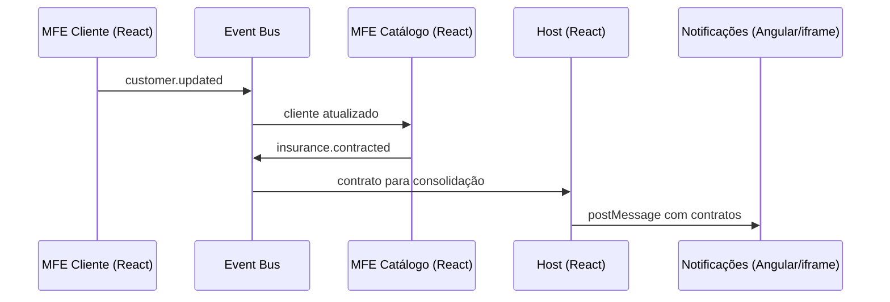

# Guia orientador — demonstração ao vivo

> **Objetivo:** transformar a explicação de arquitetura em uma demonstração prática, curta e previsível. Este documento complementa o roteiro de 1 hora: use-o durante a apresentação para saber **o que clicar, o que abrir no código e qual conceito explicar**.

## Resultado que a demonstração deve provar

Ao final, a audiência deve enxergar este fluxo completo:

Em uma frase: **cada parte tem uma responsabilidade de negócio clara, o Host orquestra a experiência e a integração acontece sem um MFE importar diretamente o outro.**

---

## Preparação antes de começar

### Checklist técnico (5 minutos antes)

- [ ] Execute `./dev.sh status`.
- [ ] Confirme as quatro portas: `5173` (Host), `5001` (Catálogo), `5002` (Cliente) e `5003` (Angular).
- [ ] Abra o Host: http://127.0.0.1:5173/.
- [ ] Mantenha o VS Code aberto neste arquivo e deixe as abas de código abaixo prontas.
- [ ] Abra o DevTools do navegador na aba **Network** e filtre por `remoteEntry` para a parte de Module Federation.
- [ ] Comece com uma aba anônima ou recarregue o Host para limpar o estado em memória dos contratos.

### Se o ambiente não estiver em execução

Na raiz do repositório, execute `./dev.sh`. O script faz o build e inicia o preview de todos os aplicativos. Para desenvolvimento sem build, use `./dev.sh dev`.

> **Estado validado em 04/08/2026:** Host e os três MFEs estavam disponíveis nas portas `5173`, `5001`, `5002` e `5003`.

### Abas de código para deixar abertas

1. [Host — orquestração e navegação](../../apps/host-react/src/main.tsx) - apps/host-react/src/main.tsx
2. [Host — configuração dos remotes](../../apps/host-react/vite.config.ts) - apps/host-react/vite.config.ts
3. [MFE Cliente — publicação do cadastro](../../apps/profile-mfe-react/src/features/register-customer/ui/RegisterCustomerForm.tsx) - apps/profile-mfe-react/src/features/register-customer/ui/RegisterCustomerForm.tsx
4. [MFE Catálogo — consumo e contratação](../../apps/dashboard-mfe-react/src/features/contract-insurance/ui/InsuranceCatalog.tsx) - apps/dashboard-mfe-react/src/features/contract-insurance/ui/InsuranceCatalog.tsx
5. [MFE Catálogo — exposição federada](../../apps/dashboard-mfe-react/vite.config.ts) - apps/dashboard-mfe-react/vite.config.ts
6. [Comunicação compartilhada](../../packages/shared-utils/src/communication.ts) - packages/shared-utils/src/communication.ts
7. [Design System](../../packages/design-system/src) - packages/design-system/src
8. [MFE Angular — consumo da ponte](../../apps/notifications-mfe-angular/src/main.ts) - apps/notifications-mfe-angular/src/main.ts

---

## Demonstração principal — 15 minutos

### 1. Mostrar o ponto de partida: Host vazio (1 minuto)

**No navegador**

1. Abra o Host em http://127.0.0.1:5173/.
2. Mostre o Dashboard inicial: cliente aguardando cadastro, zero seguros e valor mensal de R$ 0,00.
3. Aponte o menu: Dashboard, Cliente, Catálogo de seguros e Notificações.

**No código**

Abra [Host — orquestração e navegação](../../apps/host-react/src/main.tsx) e destaque:

- `PortalDashboard()`: apenas consolida e exibe dados.
- `navigate()`: muda a rota pelo hash da URL.
- `content`: decide entre tela local do Host, remoto React ou iframe Angular.

**Fala sugerida**

> “O Host é a casca da experiência: navegação, loading, fallback e visão consolidada. Ele não executa o cadastro nem contrata o seguro.”

**Conceito comprovado:** separação entre orquestração e regra de negócio.

---

### 2. Carregar o MFE Cliente e publicar um evento (3 minutos)

**No navegador**

1. Clique em **Cliente**.
2. Mostre o loading rápido e o formulário pré-preenchido.
3. Clique em **Salvar cadastro**.
4. Mostre a confirmação “Cadastro salvo com sucesso.”

**No código**

Abra [MFE Cliente — publicação do cadastro](../../apps/profile-mfe-react/src/features/register-customer/ui/RegisterCustomerForm.tsx) e siga o método `submit()`:

1. O formulário cria o objeto `customer`.
2. `setSharedState()` persiste o último cliente no `sessionStorage`.
3. `publish(INSURANCE_EVENTS.customerUpdated, customer)` emite o evento `customer.updated`.

Depois abra [Comunicação compartilhada](../../packages/shared-utils/src/communication.ts) e mostre:

- `INSURANCE_EVENTS`: nomes centralizados dos eventos.
- `publish()`: abstração sobre `window.dispatchEvent()`.
- `subscribe()`: cria uma assinatura e devolve a função de cancelamento.

**Fala sugerida**

> “O MFE Cliente não conhece o Catálogo. Ele só publica um fato de domínio: `customer.updated`. Quem tiver interesse nesse evento decide consumi-lo.”

**Conceito comprovado:** comunicação desacoplada por pub/sub.

---

### 3. Consumir o cliente e contratar no MFE Catálogo (4 minutos)

**No navegador**

1. Clique em **Catálogo de seguros**.
2. Mostre “Olá, Isabella” e o selo “Cliente identificado”.
3. Explique que o catálogo foi carregado depois do evento e ainda conhece o cliente graças ao estado de bootstrap no `sessionStorage`.
4. Clique em **Contratar seguro** para Seguro Auto.
5. Clique em mais um seguro, por exemplo Seguro Vida.
6. Mostre as mensagens de sucesso.

**No código**

Abra [MFE Catálogo — consumo e contratação](../../apps/dashboard-mfe-react/src/features/contract-insurance/ui/InsuranceCatalog.tsx) e destaque:

- O estado inicial: `getSharedState().customer` recupera o cliente caso o MFE entre depois do evento.
- O `useEffect()` com `subscribe<Customer>(INSURANCE_EVENTS.customerUpdated, setCustomer)` recebe atualizações futuras.
- A função `contract()`: cria `InsuranceContract` e publica `insurance.contracted`.

**Fala sugerida**

> “Aqui há dois mecanismos com papéis distintos: o evento mantém as aplicações reativas; o `sessionStorage` evita perder o contexto quando o catálogo é carregado depois.”

**Conceito comprovado:** um MFE consome um evento sem dependência direta e produz o próximo evento do fluxo.

---

### 4. Voltar ao Host e provar a consolidação (2 minutos)

**No navegador**

1. Clique em **Dashboard**.
2. Mostre o nome da cliente, a quantidade de seguros e o valor mensal calculado.
3. Mostre a tabela com os contratos, data e status.
4. Aponte o badge no cabeçalho com o total de apólices ativas.

**No código**

Volte para [Host — orquestração e navegação](../../apps/host-react/src/main.tsx) e mostre:

- O `useEffect()` que assina `INSURANCE_EVENTS.insuranceContracted`.
- `setContracts()`: adiciona contratos sem duplicá-los.
- `PortalDashboard()`: calcula o total e apenas apresenta os dados recebidos.

**Fala sugerida**

> “O Host não conhece o botão de contratação nem a regra de catálogo. Ele reage a `insurance.contracted` e monta uma visão consolidada.”

**Conceito comprovado:** integração orientada a eventos e Host como orquestrador.

---

### 5. Mostrar o Angular coexistindo com React (2 minutos, opcional)

**No navegador**

1. Clique em **Notificações**.
2. Mostre que a tela é um iframe Angular dentro da experiência React.
3. Mostre as notificações relativas aos contratos feitos no passo anterior.
4. Se necessário, clique em **Receber estado atual do Host (Dashboard/Profile)**.

**No código**

Abra [Host — orquestração e navegação](../../apps/host-react/src/main.tsx) e mostre `NotificationsFrame()`:

- o iframe aponta para a porta `5003`;
- `postMessageToIframe()` encaminha a lista de contratos.

Depois abra [MFE Angular — consumo da ponte](../../apps/notifications-mfe-angular/src/main.ts) e explique que ele escuta mensagens no canal `microfrontends:iframe-bridge`.

**Fala sugerida**

> “Este é um caso de coexistência tecnológica. O Angular está isolado no seu runtime; por isso a integração é explícita, via iframe e `postMessage`, não por importação direta de componentes React.”

**Conceito comprovado:** um MFE pode usar outra tecnologia, com um contrato de integração adequado.

---

### 6. Abrir a configuração de Module Federation (3 minutos)

**No DevTools**

Com a aba **Network** filtrada por `remoteEntry`, navegue entre **Cliente** e **Catálogo de seguros**. Mostre que os módulos remotos são buscados em runtime, e não incorporados estaticamente ao Host.

**No código**

1. Abra [Host — configuração dos remotes](../../apps/host-react/vite.config.ts).
2. Mostre `remotes`: `dashboard_mfe` aponta para a porta `5001` e `profile_mfe` para a porta `5002`.
3. Mostre `shared: ["react", "react-dom"]`.
4. Abra [MFE Catálogo — exposição federada](../../apps/dashboard-mfe-react/vite.config.ts).
5. Mostre `name: 'dashboard_mfe'` e `exposes: { './App': './src/App.tsx' }`.
6. Volte ao `remoteLoaders` no [Host](../../apps/host-react/src/main.tsx): `import('dashboard_mfe/App')` e `import('profile_mfe/App')`.

**Fala sugerida**

> “O remote declara o que expõe. O Host declara onde o encontra. Em tempo de execução, o Host importa `dashboard_mfe/App`. React e React DOM são compartilhados para evitar runtimes duplicados e problemas de hooks.”

**Conceito comprovado:** `exposes`, `remotes`, `remoteEntry` e dependências compartilhadas.

---

## Ordem resumida para consultar durante a fala

| Ação | Evidência visível | Arquivo a abrir | Mensagem principal |
| --- | --- | --- | --- |
| Abrir Dashboard | visão consolidada vazia | [Host](../../apps/host-react/src/main.tsx) | Host orquestra; não tem regra de contratação. |
| Salvar Cliente | confirmação de cadastro | [Formulário](../../apps/profile-mfe-react/src/features/register-customer/ui/RegisterCustomerForm.tsx) | MFE publica `customer.updated`. |
| Abrir Catálogo | “Olá, Isabella” | [Catálogo](../../apps/dashboard-mfe-react/src/features/contract-insurance/ui/InsuranceCatalog.tsx) | Catálogo consome o contexto, sem importar o Cliente. |
| Contratar 2 seguros | mensagens de sucesso | [Catálogo](../../apps/dashboard-mfe-react/src/features/contract-insurance/ui/InsuranceCatalog.tsx) | Catálogo publica `insurance.contracted`. |
| Voltar ao Dashboard | cartões, badge e tabela atualizados | [Host](../../apps/host-react/src/main.tsx) | Host consolida eventos. |
| Abrir Notificações | Angular dentro do iframe | [Angular](../../apps/notifications-mfe-angular/src/main.ts) | Tecnologias coexistem via contrato de ponte. |
| Filtrar `remoteEntry` | carregamento remoto na rede | [Configuração Host](../../apps/host-react/vite.config.ts) | Federation carrega módulos em runtime. |

---

## Design System: demonstração curta (1 minuto extra)

Se houver tempo, abra [packages/design-system/src](../../packages/design-system/src) e mostre `Button`, `Card`, `Input`, `Badge` e `Loading`.

**Fala sugerida**

> “Autonomia não pode significar interfaces inconsistentes. O Design System é o contrato visual compartilhado: cada MFE pode evoluir o seu domínio, mas usa a mesma base de componentes e tokens.”

---

## Como explicar problemas reais sem enfraquecer a demonstração

| Tema | Como está no projeto | Como falar sobre produção |
| --- | --- | --- |
| Remote indisponível | `remoteLoaders` retorna uma mensagem e `ErrorBoundary` protege a tela. | Acrescentar retry, telemetria, health check e estratégia de fallback por domínio. |
| Eventos | `CustomEvent` é simples e suficiente para o exemplo. | Para fluxos críticos, definir contratos versionados, observabilidade e, conforme o caso, backend/BFF ou broker. |
| `sessionStorage` | Reidrata o cliente quando o catálogo abre depois. | Não substitui persistência de negócio nem sincronização entre abas/usuários. |
| Contratos | Ficam em memória no Host. | Persistir em backend e recuperar estado inicial via API. |
| Versões e cache | Remotes são carregados em runtime. | Planejar compatibilidade, cache busting e tratamento de `ChunkLoadError`. |
| Angular | É isolado em iframe e usa `postMessage`. | Validar `origin`, versionar o payload e restringir o canal da mensagem. |

**Frase de fechamento**

> “Microfrontends resolvem autonomia e evolução independente, mas transferem parte da complexidade para o runtime, os contratos e a operação. A escolha só vale a pena quando o contexto organizacional justifica esse custo.”

---

## Plano B para imprevistos

### Se um remote React não carregar

1. Diga que a indisponibilidade é um problema real de runtime em MFEs.
2. Mostre o fallback em [Host — orquestração e navegação](../../apps/host-react/src/main.tsx), em `remoteLoaders` e `ErrorBoundary`.
3. Rode `./dev.sh status`; se a porta não estiver ativa, use `./dev.sh` para reiniciar o ambiente.
4. Continue a explicação pelo código e pelo diagrama de comunicação em [mfe-communication-flow.md](mfe-communication-flow.md).

### Se o estado ficar confuso durante os testes

1. Recarregue o Host para zerar os contratos em memória.
2. Se o nome de cliente persistir, isso é esperado: ele está no `sessionStorage`.
3. Para uma apresentação totalmente limpa, abra uma janela anônima ou limpe o armazenamento do site no DevTools.

### Se faltar tempo

Priorize os passos 2, 3, 4 e 6. Eles provam o essencial: **evento → consumo → contratação → consolidação → carregamento federado**. A etapa Angular e o Design System podem ficar como complemento.

---

## Encerramento em 30 segundos

> “Na prática, vimos o Cliente publicar um evento, o Catálogo consumir o contexto e publicar uma contratação, e o Host consolidar a experiência. O carregamento é remoto em runtime via Module Federation e a UI continua coesa pelo Design System. O ganho é autonomia por domínio; o cuidado necessário é tratar comunicação, disponibilidade e compatibilidade como responsabilidades de arquitetura.”
