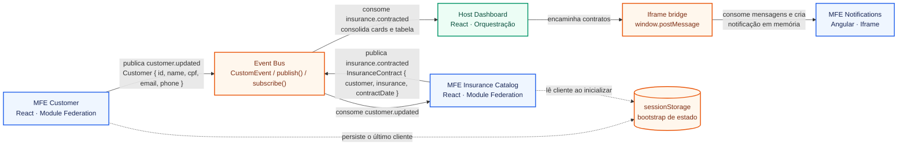

# Fluxo de comunicação entre Microfrontends

Este diagrama representa o fluxo orientado a eventos do Portal de Seguros. Os MFEs não fazem importações diretas entre si: eles trocam dados pelo Event Bus compartilhado e, no caso do Angular isolado em iframe, pela ponte `postMessage` do Host.

## Leitura para a palestra

1. **Customer** é produtor de `customer.updated` e possui apenas o cadastro do segurado.
2. **Insurance Catalog** consome o cliente, permite a contratação e se torna produtor de `insurance.contracted`.
3. **Host Dashboard** consome o contrato para compor a visão consolidada, sem executar a contratação.
4. **Notifications** recebe os contratos pelo Host, pois é um MFE Angular isolado em um iframe; sua lista é mantida em memória.
5. O `sessionStorage` não substitui os eventos: ele apenas permite que o catálogo recupere o último cliente quando é carregado depois do evento original.
